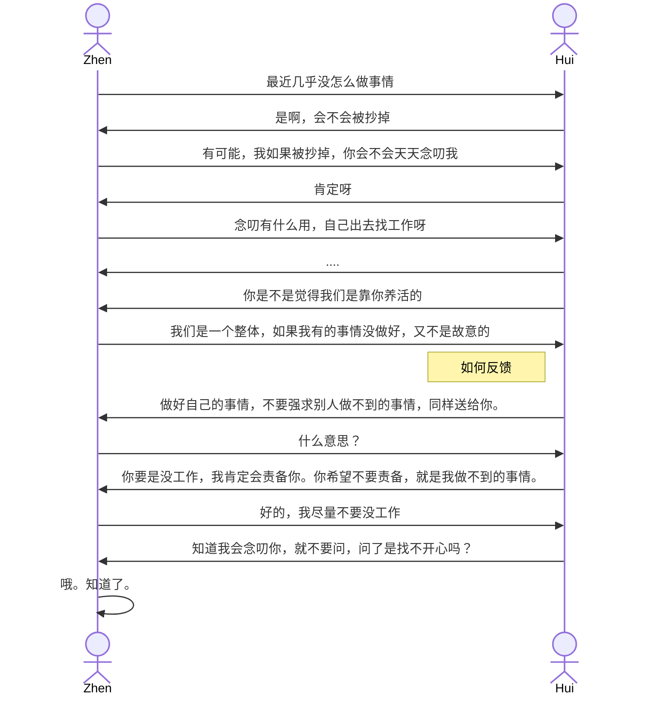

# 争执
- 2022-12-01

```mermaid
sequenceDiagram

actor Zhen
actor Hui

Zhen ->> Hui: 最近几乎没怎么做事情
Hui ->> Zhen: 是啊，会不会被抄掉
Zhen ->> Hui: 有可能，我如果被抄掉，你会不会天天念叨我
Hui ->> Zhen: 肯定呀
Zhen ->> Hui: 念叨有什么用，自己出去找工作呀
Hui ->> Zhen: ....
Hui ->> Zhen: 你是不是觉得我们是靠你养活的
Zhen ->> Hui: 我们是一个整体，如果我有的事情没做好，又不是故意的
Note Left of Hui: 如何反馈
Hui ->> Zhen: 做好自己的事情，不要强求别人做不到的事情，同样送给你。
Zhen ->> Hui: 什么意思？
Hui ->> Zhen: 你要是没工作，我肯定会责备你。你希望不要责备，就是我做不到的事情。
Zhen ->> Hui: 好的，我尽量不要没工作
Hui ->> Zhen: 知道我会念叨你，就不要问，问了是找不开心吗？
Zhen ->> Zhen: 哦。知道了。
```

