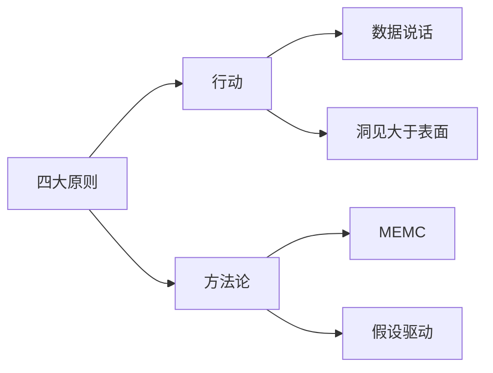

# 什么问题都可以套公式
净利问题 - MEMC原则（切得干净无重叠）
公式法： 开源和节流
子目录列举法
流程法：有可能可能性的数量呈几何倍数增加
逻辑框架法：选几个维度，给人或者事划分到对应象限。

# 四大原则

```mermaid
graph LR
O[四大原则] --> A
O --> B
A[行动] --> AA[数据说话]
A --> AB[洞见大于表面]
B[方法论] --> BA[MEMC]
B --> BB[假设驱动]
```

3.3 PEST 是用于判断一个国家或地区是否适合投资：政治/经济/社会/科技