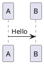
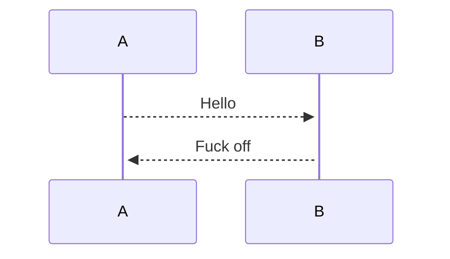

# 常用插件
1. outline：可以用来看文档目录，以及调整目录顺序。Add @[V0.8.1](https://forum.obsidian.md/t/obsidian-release-v0-8-1/3487)
2. unique note creator: 快捷键建立新 note
3. Obsidian Git: 可以同步数据到 git 仓库
4. [[3aa Obsidian Query Control]]: https://github.com/nothingislost/obsidian-query-control/ 通过BRAT安装Beta版本
5. Format Code blocks: 支持json的格式化
6. plantuml: 支持plantuml。[本地使用配合](https://plantuml.com/zh/download) 
```shell
brew install libtool 
brew link libtool 
brew install graphviz 
brew link --overwrite graphviz
```


7https://markdown.com.cn/editor/ - 发布到微信公众号
2. spaced repetition


# 基础用法


这个插入搜索的能力还是挺强的。感觉不错。
```query
记录
sort: modified
```


```query
task:("内容")
```
正在认真学习obsidian的中文文档：[中文文档](https://publish.obsidian.md/help-zh/%E6%8F%92%E4%BB%B6/%E6%90%9C%E7%B4%A2)

尝试一下任务列表
- [ ] 这是一个任务

不知道不连起来是什么样的
- [x] 这是另一个任务
- [?] 看看这个内容

之前还么有试过==高亮==
也可以试试添加脚注[^脚注1]，再试试其他脚注[^1]
脚注[^1]
[^1]: 这是很有用的
[^脚注1]: 这是另一个有用的点


H脚注的用法很简单，只需要在段落中需要插入脚注的地方标注一个符号，再在段落后对这个符号进行解释即可。比如这是一个简单的脚注，[^1] 这是一个长一些的脚注。[^长脚注] 
[^1]: 很有用！ 
[^长脚注]: 这是一个可以写长段落或者代码的地方。 你可以使用缩进在脚注中纳入其他段落。 `{ 代码 }` 这样你就可以在脚注中添加任意数量的段落了。


# 但是应该在哪里展示脚注呢？


---

```plantuml
A -> B: 你好
B -> A: 你也好
```





![[单纯记录#^2424ce]]

![[单纯记录#长期稳定]]


![[单纯记录#^test]]

