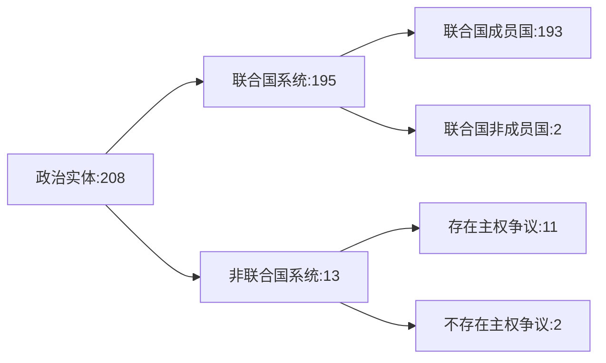

1933 年《蒙得维的亚国家权利义务公约》定义了什么是主权国家
- 有人
- 有地
- 有管人的 - 政府
- 有对外的 - 外交能力
## 统计情况

## 参考
-   [世界国家面积列表](https://zh.wikipedia.org/wiki/%E4%B8%96%E7%95%8C%E5%9C%8B%E5%AE%B6%E9%9D%A2%E7%A9%8D%E5%88%97%E8%A1%A8 "世界国家面积列表")
-   [世界国家人口列表](https://zh.wikipedia.org/wiki/%E4%B8%96%E7%95%8C%E5%9C%8B%E5%AE%B6%E4%BA%BA%E5%8F%A3%E5%88%97%E8%A1%A8 "世界国家人口列表")

