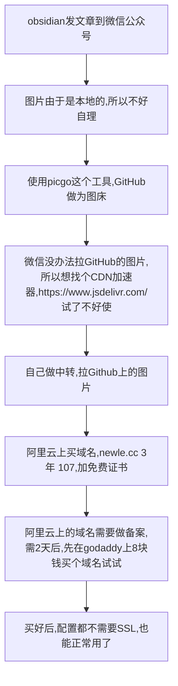

00:25 做事情

问题：
- 插件上传有问题，报错。
	- ⚠️upload failed, check dev console
	- 先放弃了
- image.newle.cc的转发有问题，mac连不上`http://image.newle.site/newle/picStore/master/image/%E6%96%B0%E8%AF%81%E4%BB%B6%E7%85%A7-1670152346221.jpg`
```nginx
      server {
          listen       443 ssl http2;
          server_name  image.newle.cc;  # your domain name
          ssl_certificate /etc/nginx/cert/9051639_image.newle.cc.pem;
          ssl_certificate_key /etc/nginx/cert/9051639_image.newle.cc.key;

          error_page   500 502 503 504  /50x.html;
          location = /50x.html {
              root   /usr/share/nginx/html;
          }

          location / {
             proxy_pass https://raw.githubusercontent.com;
          }
      }


      server {
          listen       80;
          server_name  image.newle.site;  # your domain name

          error_page   500 502 503 504  /50x.html;
          location = /50x.html {
              root   /usr/share/nginx/html;
          }

          location / {
             proxy_pass https://raw.githubusercontent.com;
          }
      }
```

02:23 折腾了2小时，哎呀。。。后面这个时间太没有效率了。