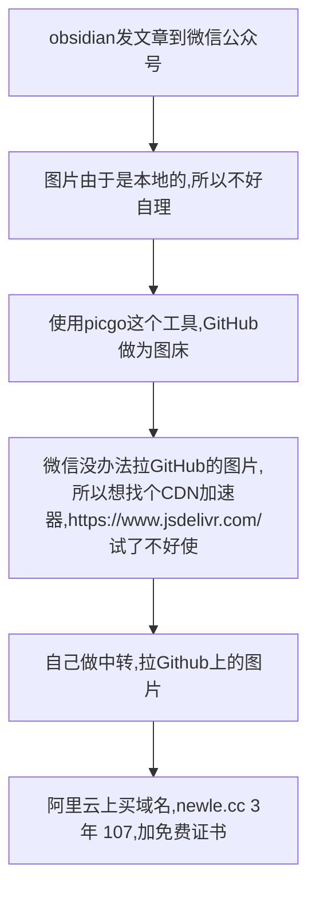

00:25 做事情

```mermaid
graph TD

A[obsidian发文章到微信公众号] --> B[图片由于是本地的,所以不好自理]
B --> C[使用picgo这个工具,GitHub做为图床]
C --> D[微信没办法拉GitHub的图片,所以想找个CDN加速器,https://www.jsdelivr.com/试了不好使]
D --> E[自己做中转,拉Github上的图片]
E --> F[阿里云上买域名,newle.cc 3年 107,加免费证书]

```
