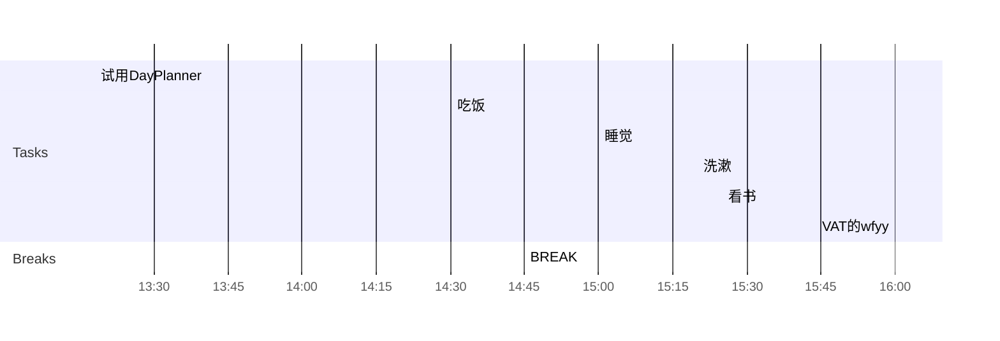

# knowledge

# diary

## Day Planner

```mermaid
gantt
    dateFormat  HH-mm
    axisFormat %H:%M
    %% Current Time: 13:23:32
    section Tasks
    试用DayPlanner     :13-18, 72mm
    吃饭     :14-30, 15mm
    睡觉     :15-00, 20mm
    洗漱     :15-20, 5mm
    看书     :15-25, 35mm
    VAT的wfyy     :16-00, 0mm
    section Breaks
    BREAK     :14-45, 15mm
```

- [ ] 13:18 试用DayPlanner
- [ ] 14:30 吃饭
- [ ] 14:45 BREAK
- [ ] 15:00 睡觉
- [ ] 15:20 洗漱
- [ ] 15:25 看书
- [ ] 16:00 VAT的wfyy
