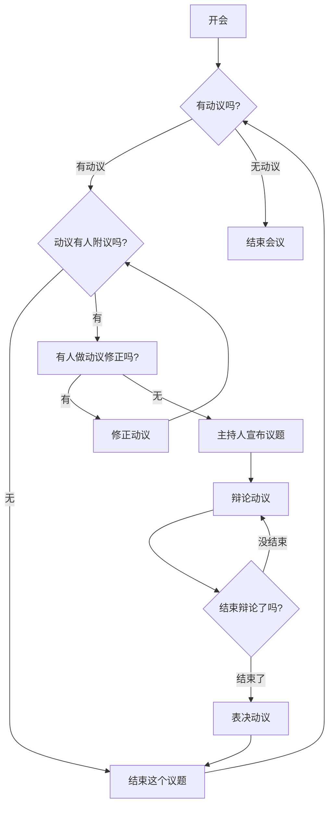

# 演练
一、主持人，只负责分配发言权，没有发言权和投票权；
二、发言规则，举手发言、别人发言不能打断，发言不能跑题，不能人身攻击；
三、议题必须是动议，动议有六要素；
四、只有主持人才能发起投票；
五、计票原则和弃权票问题；
六、程序动议优先。

1. 购买胸牌 + 笔 - done
2. 打印议事规则20份
3. 会后拍集体照
4. 现场录像：需要一个三角架。

## 开场
- 今天的目的是一起确定一个会议决策的过程。需要这个是在场的各位都认可的。我们的目的并不是希望每个决定能得到每个参会人员的同意。我们的目的是做出符合大多数人意见的决定，需要在所有人都认可的规则下等到的。
- 所以今天的第一个议题是怎么开会，怎么做决策的规则，主要解决程序问题。
- 9个人开会：
	- 4个赞成，3个反对，是否通过？
	- 1个人赞成，8个人弃权，是否通过？ - 引出真诚。
- 主持人是有口难言
- 动议6要素：时间、地点、人物、资源、行动、结果。 应该由主持人带领完善动议。会议的议题最好是公共领域的事情，而不要关心私人领域的事情。
- 附议是同意讨论，是为了讨论出结果，这样下次就不用讨论了。可能同意，也可能不同意观点。
- 大动议里的小动议可以先讨论，只要有人附议就可以。
- 有人说民主就是尊重我的权利，尊重我的权利就是“听我的”。那样别人的权利如何体现？你自己也失去了一次机会——体现对他人权利的尊重的机会。那么就投票决定吧，于是又有人说民主就是一人一票投票表决，谁的“声音大”听谁的。其实对一个方案直接用投票表决做取舍，有很大的风险，是一种非此即彼、非黑即白的二元思维，很容易走向斗争思维。表决也好投票也好，如果没有沟通理解做前提、如果没有折中妥协做前提，是很危险的，容易造成对立、撕裂、斗争。因而民主不是表决，简单靠投票解决问题甚至是多数人暴力，表决只是实现选择的方式，而不能实现多方权益、回应多方诉求。
## 口播
- 先开场，我先讲一下规则，尽量控制在30分钟以内。
- 一条一条过规则
- 会议开始，贴一下胸牌，待一会儿如果提前y
- 是否有人要提出动议，通过问问题帮忙完善动议。“时间、地点、人物、资源、行动、结果”
- 有人附议吗？
- 开始讨论
- xx 先生你来发言。 ”时间控制在2分钟以内。请先确认你的态度，然后再说明原因。“
- 有不同的意见吗？
- 有其他人要表达意见吗？
- 讨论结束，我们进入投票环节
- 赞同的人请举手。 反对的人请举手。
- 宣布议题结果。

# 议事议案

## 挂在兴农合作社墙上的议事规则最后确定版本
[[南塘议事规则十五条.docx]]
**南塘议事规则十五条**
为保证会议的公平、高效和文明，保护每个人平等的表达权利，特制定本“议事规则”。
**第一章 动议规则**
第1条 动议可行原则：会议讨论的内容应当是一系列明确的动议，“动议、动议，就是行动的建议！”动议必须是具体、明确、可操作的行动建议。
第2条 动议中心原则：先动议后讨论，无动议不讨论。动议是开会议事的基本单元。

**第二章 发言规则**
第3条 主持中立原则：“主持人”依据规则裁判并执行程序，但不能发表意见，也不能总结别人的发言。主持人要发言必须先授权他人临时主持，直到当前动议表决结束。（可能可以针对程序性的问题发表意见）
第4条 机会均等原则：发言前要举手，得到主持人允许后方可发言。先举手者优先，但尚未对当前动议发过言者，优先于已发过言者。发言请起立。
第5条 发言完整原则：不能打断别人的发言。
第6条 面对主持原则：只能对着主持人发言，参会者之间不能直接辩论。
第7条 限时限次原则：**每人每次发言的时间不得超过两分钟，对同一动议的发言每人不得超过两次，或者大家可以现场约定。**
第8条 一时一件原则：发言不能偏离当前动议的议题。一个动议表决之后才能讨论另一个动议。主持人应该打断跑题发言。
第9条 遵守裁判原则：主持人应打断违反发言规则的人，被打断者应马上停止发言。
第10条 正反轮流原则：主持人应尽量让意见相反的双方轮流得到发言机会以保持平衡。
第11条 立场明确原则：发言人应该首先表明赞成或反对，然后说明理由。
第12条 文明表达原则：不能人身攻击、不得质疑他人动机、习惯或偏好，只能就事论事。

**第三章 表决规则**
第13条 充分辩论原则：只能等到发言次数都已用尽，或者虽然次数没有用尽，没人再想发言，才能提请表决。只有主持人可以提请表决。
第14条 正反表决原则：主持人应该先请赞成方举手，再请反对方举手，但不要请弃权方举手。如果主持人享有表决权，应该最后表决。
第15条 过半通过原则：**当“赞成方”票数多于“反对方”，动议通过，平局等于没通过。**

## 流程图

## FAQ
- 什么是动议：动议要有时间、地点、人物，要有结果和完成期限，知道要花多少钱。
	- 程序动议保障听话人”不耐烦“的权利。
	- 修正案使得动议有个更宽广的中间地带。
	- 法案性质的议案不是提了就能处理，需要专门的委员会处理，拿出意见，再下一周对意见做辩论。
- 会议话题怎么来？只要满足这两个条件就可以
	- 有一个人提出”动议“
	- 有一个人附议
- 讨论前如果有人喊出”反对考虑“，则举手表决，如果有2/3的人同意，则不再讨论这个动议。有人开始发言之后，就不可以再提”反对考虑“了。
- 如何辩论
	- 举手并且主席通过之后才能发言。
	- 发言时间固定。
	- 反对意见优先。
	- 每个人的发言次数也是固定的。
	- 发言的开头需要是：我同意，我反对。
	- 攻击他人/超时/跑题/质疑动机 都会被主持人打断。
	- 遵守裁判
- 如何表决
	- 对于议题没有人再发表意见，或者发言次数用关了，刚直接表决。
	- 有人听得不耐烦，可以要求”立即表决“，这时主席可以让大家举手表决是否中止辩论，如果有2/3的人同意，则直接表决。
	- 先赞成方举手表决，然后反对方举手表决，主持人最后表决。
- 怎样算通过？
	- 赞成票多于反对票，动议通过，平局等于没通过。
	- 没过的动议不允许再在这个议会上拿出来讨论。只能等新的议会。

## 顺口溜

有口难言，主持中立；
要算本事，得是动议；
举手发言，一事一议；
面对主持，免得生气；
定时立次，提高效率；
立马打断，不许跑题；
主持叫停，得要服气；
正反轮流，皆大欢喜；
首先表态，再说道理；
就事论事，不能攻击；
话都说完，才能决议；
正反算数，弃权没戏；
多数通过，平局没过；
萝卜青菜，开会顺利。

# 一 讲背景
## 杨云标
- 因为乡下的行政粗暴，上访一直解决不了问题。
- 筹集路费，使得大家认识了他。
- 成立维权协会的事，让杨云标认识到什么叫做“沉默的大多数”
- 因为一些小胜利，确认了杨云标和唐殿林的威望。官方也希望能有渠道处理事情，所以两方都认可。顺利在乡村“执政”
- 杨云标 -》 记者 -》党国英 -》 李昌平（中国改革） -》 刘老石
- 文艺来发动群众。让大家笑着乡建。第三方有优势，能带动事情。
- 维权到合作。
## 袁天鹏
- 1998年22岁从北邮毕业。
- 美国学生议会 - 罗伯特议事章程。
- 主席做为主持人，负责分配说话权利。
	- 举手并且主席通过之后才能发言。
	- 发言时间固定。
	- 反对意见优先。
	- 每个人的发言次数也是固定的。
	- 发言的开头需要是：我同意，我反对。
	- 攻击他人/超时/跑题 都会被打断。
- 会议话题怎么来？只要满足这两个条件就可以
	- 有一个人提出”动议“
	- 有一个人附议
- 讨论前如果有人喊出”反对考虑“，则举手表决，如果有2/3的人同意，则不再讨论这个动议。有人开始发言之后，就不可以再提”反对考虑“了。
- 什么是动议：动议要有时间、地点、人物，要有结果和完成期限，知道要花多少钱。
	- 程序动议保障听话人”不耐烦“的权利。
	- 修正案使得动议有个更宽广的中间地带。
	- 法案性质的议案不是提了就能处理，需要专门的委员会处理，拿出意见，再下一周对意见做辩论。
- 如何表决
	- 对于议题没有人再发表意见，刚直接表决。
	- 有人听得不耐烦，可以要求”立即表决“，这时主席可以让大家举手表决是否中止辩论，如果有2/3的人同意，则直接表决。
- 怎样算通过？
	- 赞成票多于反对票，动议通过。
	- 没过的动议不允许再在这个议会上拿出来讨论。只能等新的议会。
- 不允许质疑动机

# 历史渊源
- 因为是带着议事规则的高度关注重读历史，袁天鹏最感兴趣的是这样的细节：第一次大陆会议前两天的议程分别是：1.核查每位代表的身份和资格；2.通过四条“辩论与表决的行为准则”；3.通过决议成立了专门委员会来讨论殖民地的权利，然后，会议进入正题。费城制宪会议之初，开头几天的议程是这样的：5月25日，选出大会主席华盛顿；选出大会秘书杰克逊；选出“议事规则委员会”委员韦思、汉密尔顿、平克尼；5月28日，大会讨论通过《议事规则》；5月29日，大会讨论并补充《议事规则》，然后，会议进入正题。叫“辩论与表决的行为准则”也好，称《议事规则》也罢，**总而言之，当他们坐到一起做的头一件事，就是制定本次会议的规则，已是约定俗成的惯例**。
- 1876年出版《罗伯特议事规则》。“在总体原则上，以国会的规则为基础；在具体细节上，以一般社团组织的需求为对象；不仅仅要包括组织和运作会议的方法，包括官员及其职责，包括各种动议的名称，还要系统地阐述每种动议的目的、效果、可辩论性、可修改性；如果可以辩论，那么辩论可以在多大程度上针对主动议展开；还有哪些情况下可以提出该动议，当该动议待决时可以提出其他什么动议，等等。”
- 孙中山的逻辑是：人民要做主，首先要学会怎么去做集体决策，集体决策就要开会，所以要学会怎么开会，就要用到议事规则。孙中山的答案是——西方人有现成的办法，就是议事规则。
- 罗伯特坚持：“一个组织必须通过正式的程序以书面的形式指定本规则为其‘议事规范’，本规则才能真正生效”，而且，组织自己制订的“特别议事规则”优先于罗氏规则本身。用我们的话来说，规则是死的，人是活的，用什么样的议事规则，决定权在组织成员自己的手里，可以全文照搬，也可以选择摘录，还可以自己确定。

