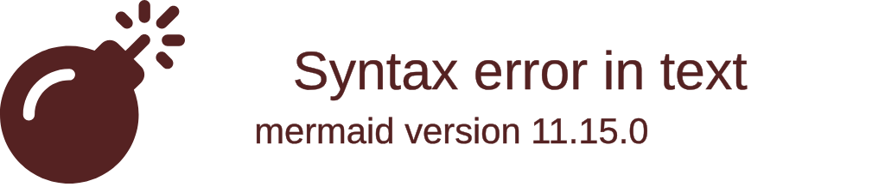
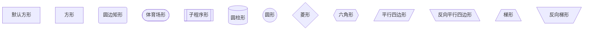
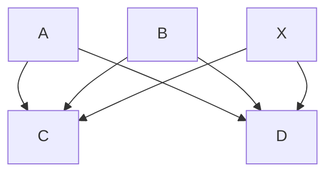
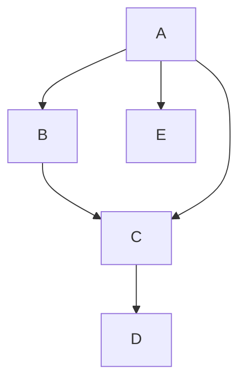
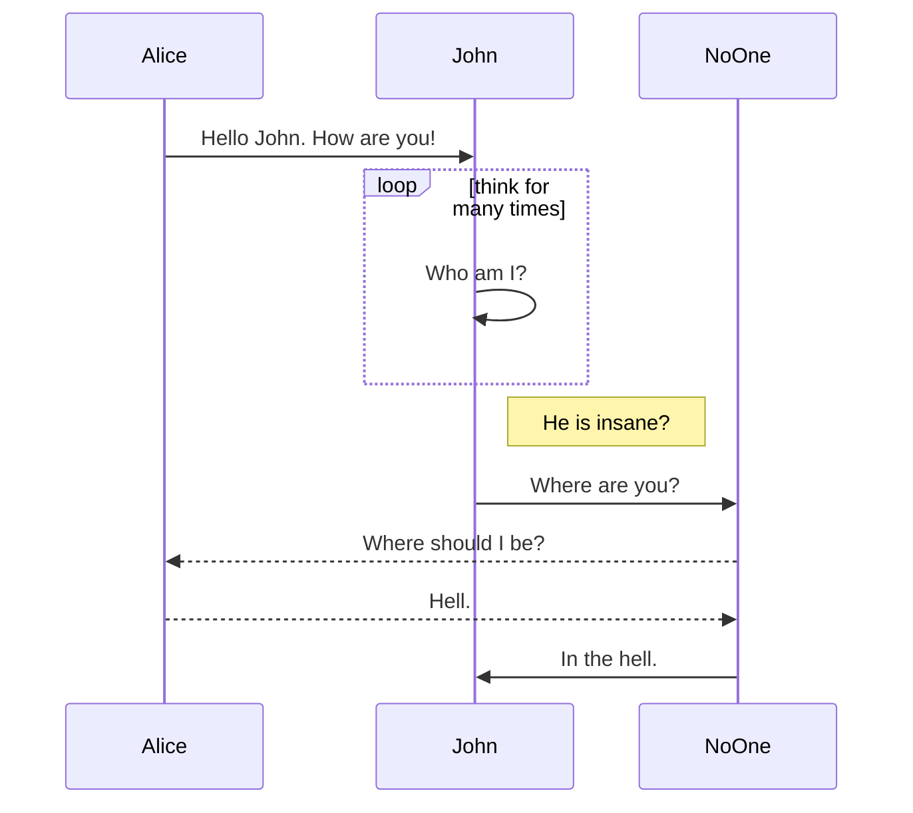
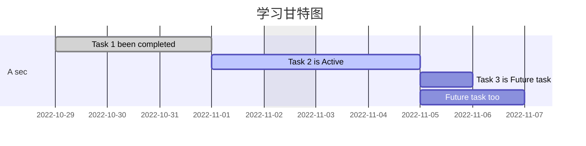
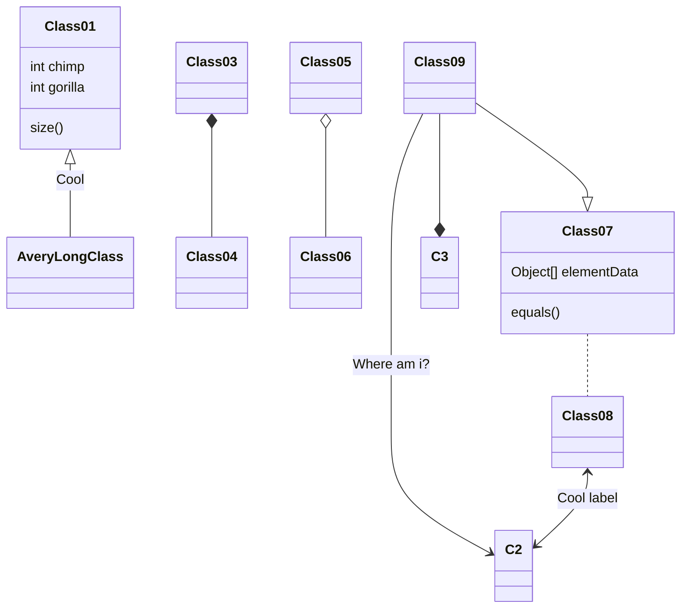

# 先从别的地方学习
* https://zhuanlan.zhihu.com/p/355997933
首先整理了mermaid能画哪些图：
1. 饼状图：使用pie做关键词，把饼画出来
2. 流程图：graph，把流程展示出来
3. 序列图：sequenceDiagram，把交互关系展示出来
4. 甘特图：gantt，把事情发生的时间段展示出来
5. 类图：classDiagram，把事物是什么，相互之间的关系展示出来
6. 状态图：stateDiagram？
7. 用户旅程图：journey?

# 示例
1. 饼状图

2. 流程图

3. 多重链

```
graph 
   A & B & X --> C & D
```


# mermaid 官网
1. 可以最简单的方式，无需编码。[Mermaid Live Editor](https://mermaid.live/)
2. 初学者只需看  [Overview for Beginners](https://mermaid-js.github.io/mermaid/#/./n00b-overview?id=overview-for-beginners)
3. 了解到 [JS Open Source Awards (2019)](https://osawards.com/javascript/#nominees)
4. 几种类型介绍
### [Flowchart](https://mermaid-js.github.io/mermaid/#/./flowchart?id=flowcharts-basic-syntax)

### [Sequence diagram](https://mermaid-js.github.io/mermaid/#/./sequenceDiagram)


### [Gantt diagram](https://mermaid-js.github.io/mermaid/#/./gantt)

### [Class diagram](https://mermaid-js.github.io/mermaid/#/./classDiagram)


### [Git graph](https://mermaid-js.github.io/mermaid/#/?id=git-graph)
```mermaid

```


