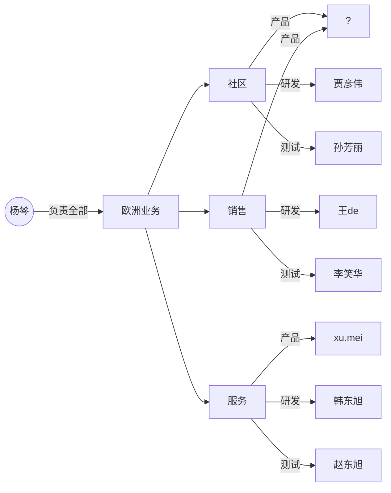

1. 社区类，强用户向的所有内容、marketing也在这里、商城等               — 彦伟

2. 销售侧：政策、leasing、试驾、leads   — 王震

3. 服务侧：PE、SO、GIS相关的             — 东旭

每一块有一个PO/TO/QO

  

前端：蔡地

测试：谢彦

    社区侧：孙芳丽

    销售侧：李笑华

    服务侧：赵东旭

APP：马超杰

  

产品：

    社区：

    销售：马越

    服务：xu.mei
